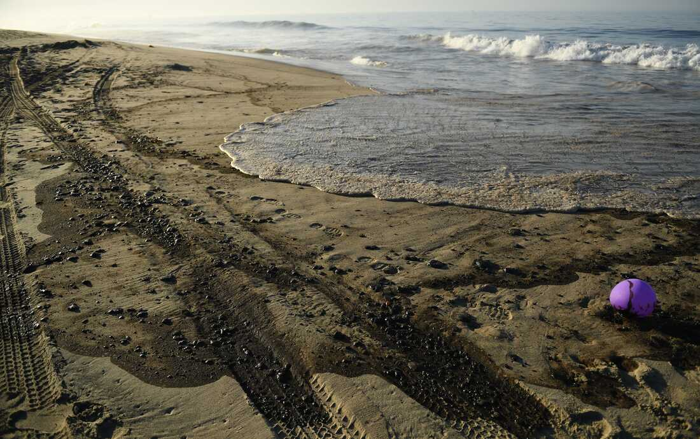

## Introduction

The following report visualizes incidences and locations of oil spills in California, tracked by the California Department of Fish and Game. First, the spills are visualized on an interactive map to show specific locations. Then, the report compares total number of spill incidences by county. 

**Data Citation:** Lampinen, Mark (2009). Oil Spill Incident Tracking [ds394]. California Department of Fish and Game, Office of Spill Prevention and Response.
https://map.dfg.ca.gov/metadata/ds0394.html?5.108.39



#### Setup
```{r setup, include=TRUE, message = FALSE, warning = FALSE}
knitr::opts_chunk$set(echo = TRUE, message = FALSE, warning = FALSE)
# attach packages
library(tidyverse)
library(janitor)
library(here)
library(sf)
library(tmap)
library(tmaptools)
```
#### Reading in the data
```{r}
# reading in the data
oil <- read_sf(here("data", "ds394", "ds394.shp")) %>% 
  clean_names()

counties <- read_sf(here("data", "ca_counties_as", "CA_Counties_TIGER2016.shp")) %>% 
  clean_names() %>% 
  mutate(county = name) %>% 
  select(county) 
```

***

## Interactive map of oil spill location
```{r}
 tmap_mode(mode = "view") # setting the tmap to viewing mode
tm_shape(counties) + # baselayer of counties
  tm_polygons(alpha = 0) + # make counties transparent to view streetmap beneath it 
  tm_shape(oil) + # add spatial points of oil spills 
  tm_dots(col = "brown3")
```

**Fig 1** shows the locations of oil spill incidences across the state of california, indicated by the red dots. County borders are included for reference. A streetmap view is available in the layers of the interactive map to understand more specific locations of spills.

***

## Oil spills by county

#### Wrangling the spatial data
```{r}
# changing coordinate reference systems to match
# counties %>% st_crs() # crs = 3857

oil_3857 <- oil %>% st_transform(3857) %>% 
  filter(inlandmari == "Inland") # filtering for inland spills

# joining spatial datasets
county_oil <- counties %>% st_join(oil_3857)

# summarizing total oil spills by county
county_oil_counts <- county_oil %>% 
  group_by(county) %>% 
  summarize(total_spills = sum(!is.na(dfgcontrol))) # ensuring that no spatial data is lost from the dataset

```

#### Visualizing oil spills by county
```{r}
# plotting the data with ggplot
ggplot() +
  geom_sf(data = county_oil_counts, # scale fill based on total number of spills within the county
          aes(fill = total_spills),
          color = "gray37", size = 0.5) +
  scale_fill_gradientn(colors = c("cornsilk1", "chocolate2", "brown3")) + # gradient color scheme
  labs(fill = "Total spills") +
  theme_void() +
  theme(legend.position = c(0.75, 0.75)) # adjusting legend position
  
```

**Fig. 2** compares total number of inland oil spills by county in California. Darker color indicates a higher number of total spills. Los Angeles County had the highest total number of spills with 512.

*** 


